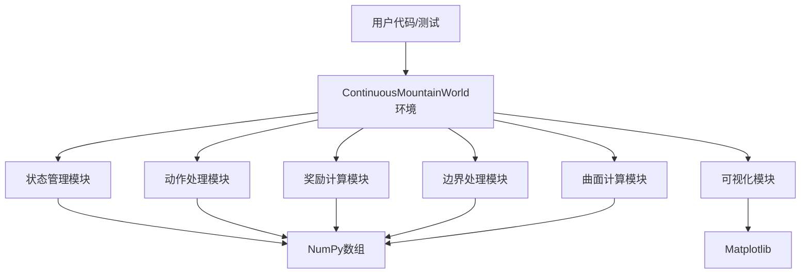

## 产品概述

一个连续矩形世界的强化学习环境，智能体可以在连续二维空间中任意移动，地形由高阶曲面表示，Q(x,y)值代表海拔高度。

## 核心功能

- 连续动作空间：二维位移向量(dx, dy)，步长限制在max_step内
- 连续状态空间：当前位置坐标(x, y)
- 高阶曲面地形：支持二阶（6个系数）和三阶（10个系数）多项式曲面，随机生成或自定义系数
- 标准接口：完全遵循OpenAI Gym接口（reset(), step(), render(), close()）
- 奖励函数：当前海拔高度Q(x, y)
- 终止条件：达到最大步数(max_steps)
- 边界处理：智能体不能超出世界边界，移动会被截断
- 可视化功能：显示地形等高线图、智能体轨迹和极值点
- 测试接口：提供完整的测试用例验证环境功能

## 技术栈选择

- **编程语言**：Python 3.8+
- **核心框架**：OpenAI Gym（环境接口标准）
- **数值计算**：NumPy（数组操作和数学计算）
- **可视化**：Matplotlib（地形渲染和轨迹绘制）
- **类型检查**：Python typing（提高代码可读性）

## 实现策略

### 环境类设计

- 创建`ContinuousMountainWorld`类，继承自`gym.Env`
- 实现完整的OpenAI Gym接口：`reset()`, `step()`, `render()`, `close()`
- 内部维护状态：当前位置、步数、历史轨迹、最高到达海拔等

### 曲面生成算法

- **二阶曲面**：Q(x,y) = a0 + a1*x + a2*y + a3*x² + a4*y² + a5*x*y
- **三阶曲面**：Q(x,y) = a0 + a1*x + a2*y + a3*x² + a4*y² + a5*x*y + a6*x³ + a7*y³ + a8*x²y + a9*xy²
- **系数生成**：使用NumPy随机生成，支持种子设置确保可重复性
- **自定义系数**：支持传入预定义的系数数组

### 动作处理流程

1. 输入动作向量(dx, dy)
2. 计算步长：√(dx² + dy²)
3. 步长限制：如果步长 > max_step，按比例缩放
4. 位置更新：x' = x + dx', y' = y + dy'
5. 边界截断：使用np.clip确保位置在世界边界内
6. 奖励计算：奖励 = Q(x', y')
7. 终止判断：步数 >= max_steps

### 性能优化

- **向量化计算**：使用NumPy广播机制高效计算曲面值
- **缓存机制**：缓存地形网格数据，避免重复计算
- **轨迹存储**：使用NumPy数组存储历史位置，内存高效

## 架构设计

### 系统架构



### 关键接口设计

```python
class ContinuousMountainWorld(gym.Env):
    def __init__(self, world_bounds=(-10, 10, -10, 10), max_step=1.0, 
                 max_steps=100, use_3rd_order=True, seed=None, 
                 surface_params=None):
        # 初始化动作空间和状态空间
        self.action_space = spaces.Box(low=-max_step, high=max_step, shape=(2,), dtype=np.float32)
        self.observation_space = spaces.Box(low=np.array([x_min, y_min]), 
                                           high=np.array([x_max, y_max]), dtype=np.float32)
    
    def reset(self, start_pos=None):
        # 重置环境，返回初始状态
    
    def step(self, action):
        # 执行动作，返回(状态, 奖励, 终止标志, 额外信息)
    
    def render(self, mode='human', show_trajectory=True, show_max_point=True):
        # 可视化环境
    
    def get_altitude(self, x, y):
        # 计算任意位置的海拔高度
    
    def get_current_altitude(self):
        # 获取当前位置的海拔高度
```

## 目录结构

```
连续矩形世界强化学习环境实现—1772673278591/
├── continuous_mountain_env.py          # [NEW] 主环境类实现
├── tmp.py                              # [MODIFY] 更新导入语句，添加缺失的import
├── requirements.txt                    # [NEW] 依赖包列表
└── README.md                           # [MODIFY] 添加环境使用说明
```

### 文件详细说明

1. **continuous_mountain_env.py**：主环境类文件

- 实现`ContinuousMountainWorld`类，继承自`gym.Env`
- 包含曲面生成、动作处理、边界限制、奖励计算等核心逻辑
- 提供完整的OpenAI Gym接口方法
- 实现可视化渲染功能

2. **tmp.py**：现有测试文件

- 在文件顶部添加缺失的import语句（import numpy as np, import matplotlib.pyplot as plt）
- 添加环境类导入：`from continuous_mountain_env import ContinuousMountainWorld`
- 保持现有测试函数不变，确保测试通过

3. **requirements.txt**：依赖包列表

- gym>=0.26.0
- numpy>=1.21.0
- matplotlib>=3.5.0

## 关键代码结构

### 核心数据结构

```python
from typing import Tuple, Optional, Dict, Any
import numpy as np
import gym
from gym import spaces

class ContinuousMountainWorld(gym.Env):
    metadata = {'render.modes': ['human', 'rgb_array']}
    
    def __init__(self, 
                 world_bounds: Tuple[float, float, float, float] = (-10, 10, -10, 10),
                 max_step: float = 1.0,
                 max_steps: int = 100,
                 use_3rd_order: bool = True,
                 seed: Optional[int] = None,
                 surface_params: Optional[np.ndarray] = None):
        # 参数解析和初始化
        self.x_min, self.x_max, self.y_min, self.y_max = world_bounds
        self.max_step = max_step
        self.max_steps = max_steps
        self.use_3rd_order = use_3rd_order
        
        # 动作空间和状态空间定义
        self.action_space = spaces.Box(
            low=-max_step, high=max_step, shape=(2,), dtype=np.float32
        )
        self.observation_space = spaces.Box(
            low=np.array([self.x_min, self.y_min]),
            high=np.array([self.x_max, self.y_max]),
            dtype=np.float32
        )
        
        # 曲面系数生成
        self.surface_params = self._generate_surface_params(use_3rd_order, seed, surface_params)
        
        # 状态变量
        self.reset()
```

### 曲面计算函数

```python
def _calculate_altitude(self, x: float, y: float) -> float:
    """计算给定位置的海拔高度"""
    if self.use_3rd_order:
        # 三阶曲面计算
        return (self.surface_params[0] + self.surface_params[1]*x + self.surface_params[2]*y +
                self.surface_params[3]*x**2 + self.surface_params[4]*y**2 + self.surface_params[5]*x*y +
                self.surface_params[6]*x**3 + self.surface_params[7]*y**3 +
                self.surface_params[8]*x**2*y + self.surface_params[9]*x*y**2)
    else:
        # 二阶曲面计算
        return (self.surface_params[0] + self.surface_params[1]*x + self.surface_params[2]*y +
                self.surface_params[3]*x**2 + self.surface_params[4]*y**2 + self.surface_params[5]*x*y)
```

## 代理扩展

### SubAgent

- **code-explorer**
- 目的：深入探索现有tmp.py文件的结构和模式，确保新环境类与现有测试代码兼容
- 预期结果：理解tmp.py中的测试函数对环境类的期望接口，识别需要实现的属性和方法

### Skill

- **skill-creator**
- 目的：创建环境类模板和测试用例模板，确保代码结构符合最佳实践
- 预期结果：生成标准化的环境类框架，包含完整的OpenAI Gym接口实现